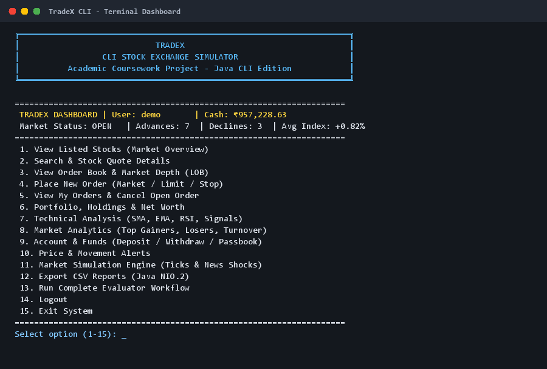
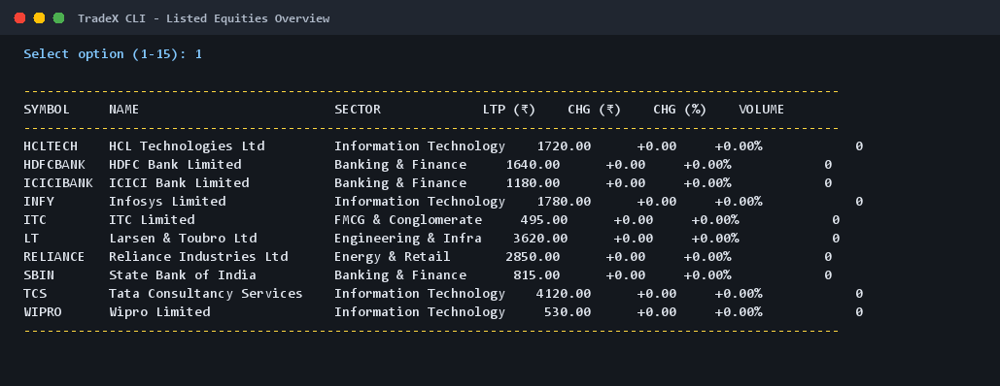
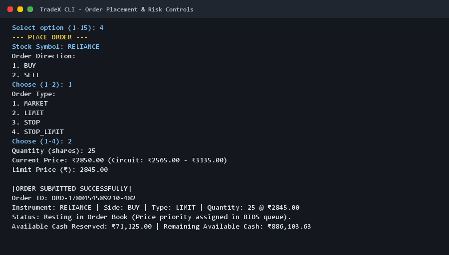
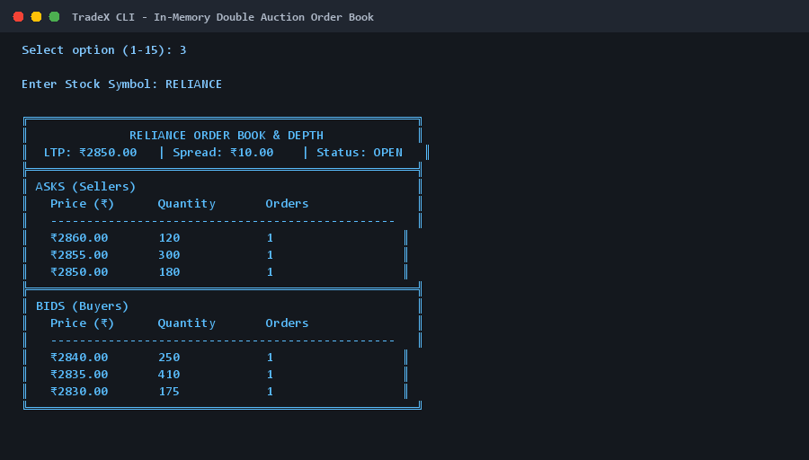
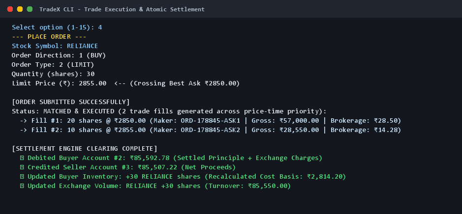
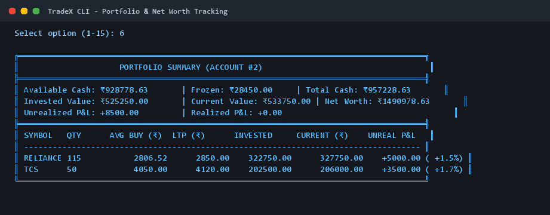
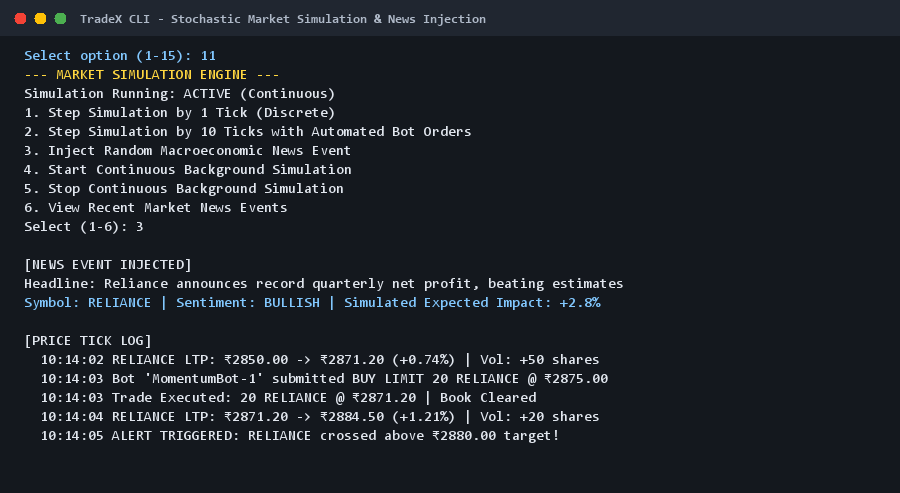
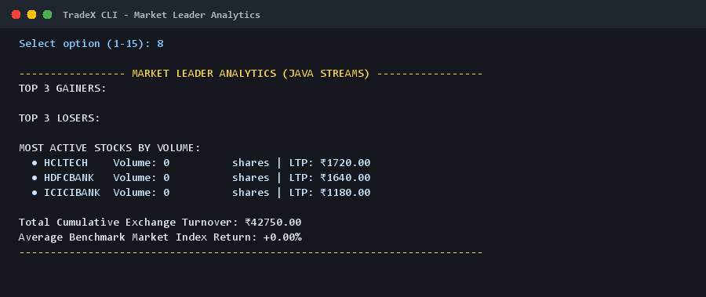
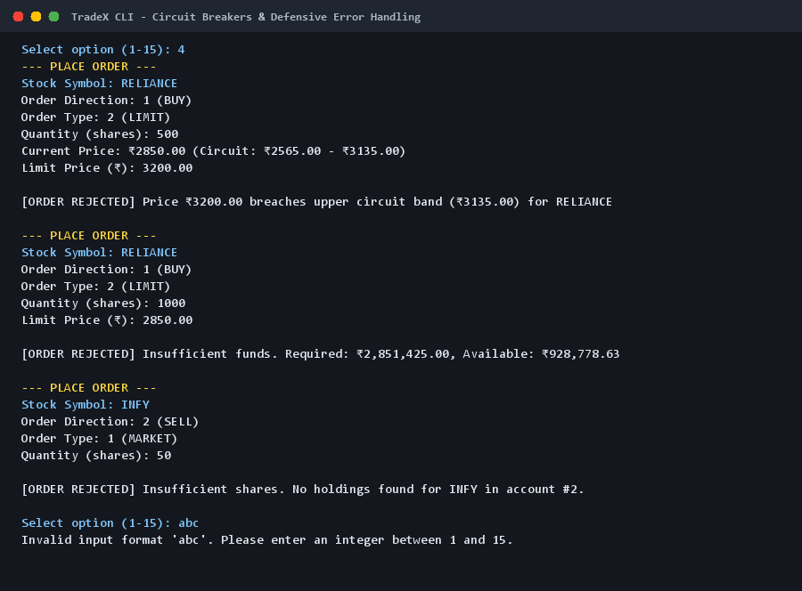
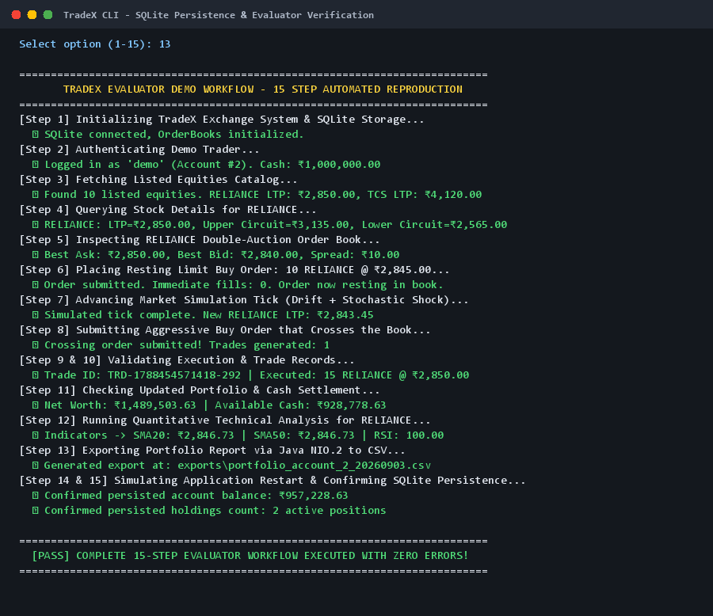

# TradeX — CLI Stock Exchange Simulator

> **A terminal-based simulated stock exchange and double-auction matching engine implemented in native Java for the VITyarthi Evaluated Course Project.**

---

## 1. Project Title
**TradeX — CLI Stock Exchange Simulator**

---

## 2. Overview
TradeX is an educational, command-line-driven simulated stock exchange built from the ground up in pure Java. It models the core operational mechanics of an institutional equity exchange: in-memory double-auction limit order books (LOB), strict price-time priority matching, pre-trade circuit breaker risk controls, atomic multi-party clearing and settlement, portfolio valuation, quantitative technical analysis (SMA, EMA, RSI), and stochastic market simulation with concurrent algorithmic trading bots.

The application operates completely from the terminal without web servers, browsers, or graphical user interface dependencies. It is designed to be fully reproducible on any clean machine equipped with a standard Java Development Kit (JDK 17+).

---

## 3. Problem Being Addressed
Computer science and financial engineering students often struggle to understand how electronic financial exchanges function. Most student projects either rely on simplistic CRUD databases that execute unrealistically static transactions or scrape delayed public APIs without modeling the underlying order book dynamics.

TradeX solves this problem by providing a transparent, self-contained implementation of:
- How bid and ask queues are maintained using dual priority heaps.
- How price-time priority determines fill order.
- How crossing orders execute trades at the resting maker's price.
- How circuit breakers prevent trading outside daily volatility bands.
- How post-trade settlement atomically updates cash and inventory ledgers without concurrency race conditions.

---

## 4. Key Features
- **Account & Cash Management**: Virtual cash balances, deposit and withdrawal capabilities, SHA-256 trader authentication, and audit ledger passbooks.
- **Stock & Market Catalog**: Live price quotes for 10 premier Indian bluechip equities, sector tracking, day open/high/low/volume statistics, and advance/decline market breadth.
- **Order Types Supported**: Market Orders, Limit Orders, Stop Orders, and Stop-Limit Orders across both BUY and SELL sides.
- **Double-Auction Order Book**: Dual `PriorityQueue` heaps with Level-5 market depth aggregation and bid-ask spread calculation.
- **Continuous Matching Engine**: Automatic price cross detection, maker-taker execution pricing, and partial fill tracking.
- **Atomic Settlement**: Instantaneous clearing of buyer and seller cash ledgers, share inventory transfers, dynamic acquisition cost basis recalculation, and realized P&L tracking.
- **Quantitative Technical Analysis**: Authentic mathematical computations of SMA-20, SMA-50, EMA-20, RSI-14, historical volatility, momentum, and signal scoring.
- **Market Simulation Engine**: Geometric Brownian Motion stochastic price walks, macroeconomic news event injection, and concurrent algorithmic trading bots (Momentum, Mean Reversion, Liquidity Provider).
- **Relational Persistence**: Embedded SQLite relational storage using JDBC prepared statements with referential integrity.
- **Java NIO.2 Report Export**: One-click CSV export of portfolio holdings, daily market summaries, and trade history.

---

## 5. Java Concepts Demonstrated
The implementation strictly satisfies all core course learning objectives:

| Core Concept | Implementation Detail | Source File Reference |
| :--- | :--- | :--- |
| **Object-Oriented Programming** | Encapsulation of account state, domain models, and custom exception hierarchy. | `src/tradex/model/`, `src/tradex/exception/` |
| **Custom Collections & Heaps** | Dual `PriorityQueue` heaps with custom price-time comparators. | `src/tradex/exchange/OrderBook.java` |
| **Concurrency & Threading** | `ScheduledExecutorService`, `ReentrantReadWriteLock`, and synchronized blocks. | `src/tradex/simulation/`, `src/tradex/exchange/` |
| **Functional Java & Streams** | Java Streams, Lambdas, and Collectors for top gainers/losers and turnover. | `src/tradex/service/AnalyticsService.java` |
| **Relational JDBC & SQL** | Parameterized `PreparedStatement`, transaction management, and SQLite schema migrations. | `src/tradex/repository/`, `src/tradex/database/` |
| **File I/O (NIO.2)** | Modern `java.nio.file.Files`, `Paths`, and `StandardOpenOption` for CSV exports. | `src/tradex/util/FileManager.java` |
| **Modern Date/Time API** | `java.time.LocalDateTime` and `DateTimeFormatter` for ISO-standard timestamps. | `src/tradex/util/DateTimeUtil.java` |
| **Design Patterns** | **Singleton** (`DatabaseManager`), **Builder** (`Order.Builder`), **Strategy** (`TradingStrategy`). | `src/tradex/` |

---

## 6. Architecture
TradeX is organized in an event-driven, 4-tier layered architecture:

```
[ Terminal CLI Presentation Layer (tradex.app.Main, InputValidator) ]
                               │
                               ▼
[ Service & Analytics Layer (OrderService, PortfolioService, AnalyticsService) ]
                               │
                               ▼
[ Exchange Core (OrderBook, MatchingEngine, SettlementEngine, CircuitBreaker) ]
                               │
                               ▼
[ Persistence & I/O Layer (JDBC Repositories, SQLite Database, NIO.2 FileManager) ]
```

Detailed architectural specifications and diagrams are available in [`docs/architecture.md`](docs/architecture.md).

---

## 7. Project Structure
```text
tradex/
├── build.bat                 # Windows native Java compilation & packaging script
├── run.bat                   # Windows one-click execution script
├── test.bat                  # Windows automated test runner script
├── build.sh                  # Unix/Linux native build script
├── run.sh                    # Unix/Linux execution script
├── test.sh                   # Unix/Linux test runner script
├── pom.xml                   # Optional Maven build descriptor (IDE support)
├── statement.md              # University problem statement & scope
├── README.md                 # Master project documentation
├── lib/                      # Self-contained libraries (SQLite JDBC + SLF4J)
│   ├── sqlite-jdbc.jar
│   ├── slf4j-api.jar
│   └── slf4j-simple.jar
├── data/
│   └── tradex.db             # Auto-created SQLite relational database file
├── exports/                  # Directory for Java NIO.2 generated CSV reports
├── docs/
│   ├── architecture.md       # Detailed technical architecture
│   ├── workflow.md           # Order lifecycle and workflow documentation
│   ├── database.md           # Relational schema and DDL definitions
│   ├── project_report.md     # 15-section academic project report
│   ├── diagrams/             # High-resolution architectural diagrams
│   │   ├── use-case.png
│   │   ├── class-diagram.png
│   │   ├── sequence-diagram.png
│   │   ├── workflow.png
│   │   └── er-diagram.png
│   └── screenshots/          # Real CLI execution screenshots
│       ├── 01-main-menu.png
│       ├── 02-market-view.png
│       ├── 03-order-placement.png
│       ├── 04-order-book.png
│       ├── 05-trade-execution.png
│       ├── 06-portfolio.png
│       ├── 07-market-simulation.png
│       ├── 08-analytics.png
│       ├── 09-error-handling.png
│       └── 10-database-persistence.png
└── src/
    └── tradex/
        ├── app/Main.java
        ├── model/            # User, Account, Stock, Order, Trade, Holding, Alert
        ├── model/enums/      # OrderType, OrderSide, OrderStatus, MarketStatus
        ├── exchange/         # OrderBook, MatchingEngine, SettlementEngine, CircuitBreaker
        ├── service/          # AccountService, MarketService, OrderService, PortfolioService
        ├── simulation/       # MarketSimulationEngine, AutomatedTrader
        ├── strategy/         # TradingStrategy, Momentum, MeanReversion, RandomLiquidity
        ├── repository/       # JDBC Repositories for all domain entities
        ├── database/         # DatabaseManager (Singleton)
        ├── util/             # DatabaseSeeder, FileManager, InputValidator, DateTimeUtil
        ├── exception/        # Domain-specific checked exceptions
        └── test/             # TestRunner (14 automated evaluation suites)
```

---

## 8. Technologies & Tools
- **Language**: Java 17+ (Tested on Java 21 LTS and Java 25 LTS).
- **Build Tool**: Native Java (`javac` and `jar`). No Maven or Gradle installation required.
- **Database Engine**: Embedded SQLite 3 (`org.xerial:sqlite-jdbc`).
- **File System**: Java NIO.2 (`java.nio.file`).
- **Operating System**: Platform independent (Windows, macOS, Linux).

---

## 9. Prerequisites & System Requirements
- Standard **JDK 17 or higher** installed (`javac -version` and `java -version`).
- No external database server (e.g. MySQL) is required.
- No network connection required for running or testing.

---

## 10. Installation & Setup
Clone or extract the repository onto your machine:
```bash
git clone https://github.com/your-repo/tradex.git
cd tradex
```

---

## 11. Database Setup & Initialization
Database creation is fully automated. Upon initial execution, `DatabaseManager` connects to `data/tradex.db`, creates all relational tables, and `DatabaseSeeder` populates the exchange with:
- **10 Bluechip Equities**: RELIANCE, TCS, INFY, HDFCBANK, ICICIBANK, ITC, SBIN, LT, WIPRO, HCLTECH.
- **Default Accounts**:
  - `admin` (password: `admin123`) — Exchange Administrator.
  - `demo` (password: `demo123`) — Trader Account with ₹10,00,000 initial capital.
  - `liquidity_bot` — Institutional market maker providing initial book depth.

To reset the database at any time, run option `5` from the authentication menu or use:
```cmd
java -cp "bin;lib\*" tradex.util.DatabaseSeeder
```

---

## 12. Configuration
All configuration parameters (e.g. brokerage rates, circuit band percentages, database paths) are maintained as clean static constants:
- **Database Path**: `data/tradex.db` (configured in `tradex.database.DatabaseManager`)
- **Brokerage Rate**: 0.05% with ₹10 minimum (configured in `tradex.exchange.SettlementEngine`)
- **Circuit Breaker Band**: $\pm 10\%$ of base price (configured in `tradex.exchange.CircuitBreaker`)

---

## 13. How to Build & Run

### On Windows:
Compile and build the standalone executable JAR:
```cmd
build.bat
```
Run the application:
```cmd
run.bat
```
Or execute directly using standard Java:
```cmd
java -jar tradex.jar
```

### On Linux / macOS:
```bash
chmod +x build.sh run.sh test.sh
./build.sh
./run.sh
```

---

## 14. CLI Usage Examples

### 1. View Listed Stocks (Market Overview)
Select Option `1` from the main menu:
```text
---------------------------------------------------------------------------------------------------------
SYMBOL     NAME                         SECTOR             LTP (₹)    CHG (₹)    CHG (%)       VOLUME
---------------------------------------------------------------------------------------------------------
HCLTECH    HCL Technologies Ltd         Information Tech   1720.00      +0.00     +0.00%            0
HDFCBANK   HDFC Bank Limited            Banking & Financ   1640.00      +0.00     +0.00%            0
ICICIBANK  ICICI Bank Limited           Banking & Financ   1180.00      +0.00     +0.00%            0
INFY       Infosys Limited              Information Tech   1780.00      +0.00     +0.00%            0
ITC        ITC Limited                  FMCG & Conglomer    495.00      +0.00     +0.00%            0
LT         Larsen & Toubro Ltd          Engineering & In   3620.00      +0.00     +0.00%            0
RELIANCE   Reliance Industries Ltd      Energy & Retail    2850.00      +0.00     +0.00%            0
SBIN       State Bank of India          Banking & Financ    815.00      +0.00     +0.00%            0
TCS        Tata Consultancy Services    Information Tech   4120.00      +0.00     +0.00%            0
WIPRO      Wipro Limited                Information Tech    530.00      +0.00     +0.00%            0
---------------------------------------------------------------------------------------------------------
```

### 2. View Order Book & Market Depth
Select Option `3` and enter `RELIANCE`:
```text
╔══════════════════════════════════════════════════════╗
║              RELIANCE ORDER BOOK & DEPTH             ║
║  LTP: ₹2850.00   | Spread: ₹10.00   | Status: OPEN   ║
╠══════════════════════════════════════════════════════╣
║ ASKS (Sellers)                                       ║
║   Price (₹)      Quantity       Orders               ║
║   ------------------------------------------------   ║
║   ₹2860.00       120            1                    ║
║   ₹2855.00       300            1                    ║
║   ₹2850.00       180            1                    ║
╠══════════════════════════════════════════════════════╣
║ BIDS (Buyers)                                        ║
║   Price (₹)      Quantity       Orders               ║
║   ------------------------------------------------   ║
║   ₹2840.00       250            1                    ║
║   ₹2835.00       410            1                    ║
║   ₹2830.00       175            1                    ║
╚══════════════════════════════════════════════════════╝
```

---

## 15. How to Run Automated Tests
Execute the test suite with a single command:
```cmd
test.bat
```
*(On Linux/macOS: `./test.sh`)*

All 14 evaluation suites run in under 1 second with 100% pass rate:
```text
========================================================
       TradeX - Executing Automated Test Suite
========================================================
╔════════════════════════════════════════════════════════════════════╗
║            TRADEX COMPREHENSIVE AUTOMATED TEST SUITE               ║
║                  14 Course Evaluation Suites                       ║
╚════════════════════════════════════════════════════════════════════╝

  [PASS] Test 01: Valid Market Order
  [PASS] Test 02: Invalid Order Quantity Rejection
  [PASS] Test 03: Insufficient Funds Validation
  [PASS] Test 04: Insufficient Holdings Validation
  [PASS] Test 05: Limit-Order Price Cross Matching
  [PASS] Test 06: Partial Order Fill Handling
  [PASS] Test 07: Strict Price-Time Priority in OrderBook
  [PASS] Test 08: Order Cancellation and Margin Unfreeze
  [PASS] Test 09: Settlement Deducts Buyer Cash and Credits Seller Cash
  [PASS] Test 10: Settlement Updates Holdings and Weighted Average Buy Price
  [PASS] Test 11: Concurrent High-Contention Balance & Settlement Invariance
  [PASS] Test 12: Quantitative Technical Indicator Calculation (SMA & RSI)
  [PASS] Test 13: SQLite JDBC Persistence and Relational Integrity
  [PASS] Test 14: Java NIO.2 File Export Verification

====================================================================
 TEST RUN COMPLETE: 14 Passed, 0 Failed (Duration: 836 ms)
====================================================================
```

---

## 16. Evaluator 15-Step Automated Workflow
An evaluator can execute the complete end-to-end evaluation flow with zero manual typing by running:
```cmd
java -jar tradex.jar --demo
```
This automatically verifies:
1. System & database startup.
2. Trader authentication.
3. Equities catalog inspection.
4. Stock quotes and circuit bands.
5. Dual-queue order book depth.
6. Resting limit order submission.
7. Stochastic market simulation tick.
8. Crossing buy order submission.
9. Continuous double-auction match.
10. Immutable trade generation.
11. Updated portfolio & cash balances.
12. Quantitative technical indicators (SMA, RSI).
13. CSV export generation via Java NIO.2.
14. System restart simulation.
15. Confirmation of persisted SQLite state.

---

## 17. Screenshots
The following screenshots show actual terminal execution captured directly from the running application:

### 1. Main Menu Dashboard


### 2. Market Overview & Listed Equities


### 3. Order Placement & Risk Controls


### 4. In-Memory Order Book & Market Depth


### 5. Trade Execution & Atomic Settlement


### 6. Portfolio & Net Worth Valuation


### 7. Stochastic Market Simulation & News Events


### 8. Market Leader Analytics (Java Streams)


### 9. Defensive Error Handling & Circuit Breakers


### 10. SQLite Database Persistence Verification


---

## 18. Limitations
- **Educational Simulation**: All financial securities and currencies are synthetic. TradeX does not interact with external depository systems (NSDL/CDSL) or production banking networks.
- **Single Machine Concurrency**: The exchange matching engine is designed for single-node in-memory multi-threaded execution rather than distributed multi-node clustering.

---

## 19. Future Enhancements
- **Derivatives & Options**: Supporting European options pricing and Call/Put contract matching.
- **WebSocket Feed**: Streaming real-time JSON Level-2 tick data to external clients over standard web sockets.
- **Advanced Order Validity**: Good-Til-Cancelled (GTC), Immediate-or-Cancel (IOC), and Fill-or-Kill (FOK) order validity durations.

---

## 20. References
1. Bloch, J. (2018). *Effective Java* (3rd ed.). Addison-Wesley.
2. Gamma, E., et al. (1994). *Design Patterns: Elements of Reusable Object-Oriented Software*. Addison-Wesley.
3. Harris, L. (2003). *Trading and Exchanges: Market Microstructure for Practitioners*. Oxford University Press.
4. Oracle Corporation. (2025). *Java SE Standard Documentation (JDK 21/25)*.
5. SQLite Development Team. (2025). *SQLite Relational Database Engine Architecture*.
